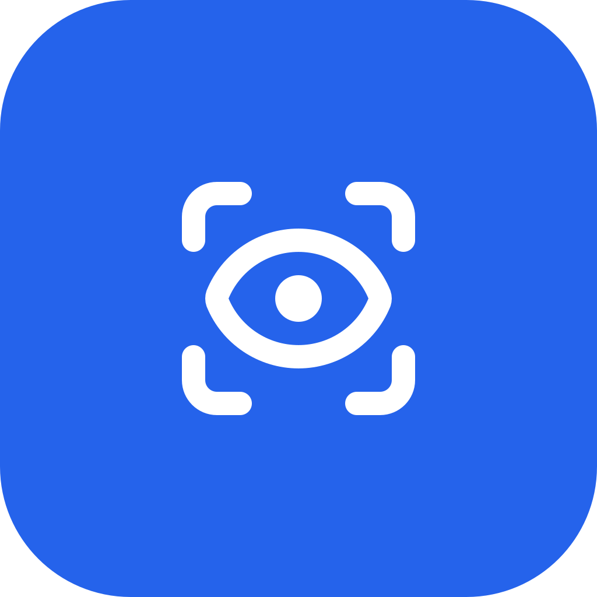

<div align="center">
  
  <h1>Oraculo</h1>
  <p><strong>Um guia socrático e orquestrador de equipe para desenvolvimento de produto com qualidade.</strong></p>
  <p>Pergunta antes de fazer. Planeja antes de construir. Valida antes de entregar.</p>

  <p>
    <a href="#instalar"></a>
    
    
    
  </p>

  <p>
    <a href="README.md">Read in English</a>
  </p>
</div>

---

## O problema com IA que "só faz"

A maioria das ferramentas de IA para código tem a mesma postura padrão: você descreve algo, ela constrói. Rápido. Com confiança. Frequentemente errado de formas que você só descobre na review da sprint.

Elas pulam a parte onde alguém pergunta *"esse é realmente o problema certo a resolver?"* Pulam a revisão de arquitetura. Pulam o QA independente. E quando você precisa de julgamento humano — uma decisão de tradeoff, uma definição de escopo — não há onde pausar.

**O Oraculo toma a posição oposta.**

Ele trata código como o último passo, não o primeiro. Antes de qualquer implementação, ele guia sua equipe através de descoberta e planejamento estruturados. Quando é hora de construir, ele monta uma equipe coordenada de agentes — não um único ator correndo para a conclusão. E em cada ponto crítico de decisão, ele para e espera por um veredicto humano.

---

## Como funciona

O Oraculo opera como um **guia socrático** durante a descoberta e um **orquestrador de equipe** durante a execução. Ele nunca escreve código diretamente — delega para agentes especializados enquanto permanece como a única fonte de coordenação.

### O fluxo de trabalho

```
Épico  →  Descobrir  →  Planejar  →  Executar  →  Validar
Story              →  Planejar  →  Executar  →  Validar
```

**Descobrir** — O Oraculo questiona sua ideia. Ele identifica casos extremos, riscos e desafia premissas antes que qualquer coisa seja definida. O resultado é um documento de requisitos revisado e aprovado pela sua equipe.

**Planejar** — Os requisitos são decompostos em um grafo de dependências (DAG). Dois agentes de pesquisa paralelos analisam o código-fonte e melhores práticas externas, produzindo um design arquitetural. O design passa por um gate de aprovação obrigatório antes de qualquer código ser escrito.

**Executar** — Uma equipe de agentes trabalha em paralelo, respeitando a ordem de dependências do DAG. Toda tarefa segue TDD — testes primeiro, implementação depois. Agentes são autossuficientes: cada um recebe seu contexto completo, padrões do projeto e comportamento esperado.

**Validar** — Um agente de QA dedicado revisa a implementação com olhos frescos. Sem viés de ter escrito o código. Se rejeitar, o fluxo retorna à fase apropriada — nada é forçado.

### Gates com humano no controle

O Oraculo não automatiza além das decisões que importam. Três gates obrigatórios pausam o fluxo até que um humano entregue um veredicto através do dashboard:

| Gate | Quando | Veredictos |
|---|---|---|
| **Design** | Após a arquitetura ser rascunhada, antes de qualquer código | `approved` / `rejected` / `needs_revision` |
| **Plano de Execução** | Antes dos agentes serem despachados (épicos grandes) | `approved` / `rejected` / `needs_revision` |
| **Escalação de QA** | Quando QA encontra um defeito crítico que não consegue resolver | `approved` / `rejected` / `needs_revision` |

Revisões de documentos (requisitos, definições de stories) usam um sistema de versionamento separado com veredictos `approved` / `rejected`.

---

## O dashboard

<div align="center">
  
  <br/>
  <em>Controle de Missão — não um visualizador de logs.</em>
</div>

O dashboard é a superfície de observação e controle do Oraculo. Ele mostra:

- **Atividade dos agentes em tempo real** — quais agentes estão rodando, o que estão fazendo, quando terminam
- **Visualização do DAG** — o grafo completo de tarefas com status em tempo real
- **Gates de aprovação** — exibe artefatos para revisão e coleta veredictos humanos
- **Base de conhecimento** — lições aprendidas acumuladas de todos os épicos

Atualizações em tempo real fluem por dois canais: HTTP hooks enviam eventos de telemetria conforme acontecem; MCP entrega notificações bloqueantes de gates de aprovação quando um agente aguarda um veredicto.

---

## Como o Oraculo se compara

| | Oraculo | Ferramentas "faz logo" | Superpowers | spec-workflow-mcp |
|---|:---:|:---:|:---:|:---:|
| Descoberta e questionamento socrático | ✅ | ❌ | ❌ | Parcial |
| Gate de revisão de arquitetura | ✅ | ❌ | ❌ | ❌ |
| Orquestração paralela de agentes (DAG) | ✅ | ❌ | ❌ | ❌ |
| TDD aplicado em todos os agentes | ✅ | ❌ | Depende da skill | ❌ |
| Agente de QA independente | ✅ | ❌ | ❌ | ❌ |
| Gates de aprovação com humano no controle | ✅ | ❌ | ❌ | ❌ |
| Acumulação persistente de conhecimento | ✅ | ❌ | ❌ | ❌ |
| Dashboard em tempo real (Controle de Missão) | ✅ | ❌ | ❌ | ❌ |
| Funciona com seu projeto existente | ✅ | ✅ | ✅ | ✅ |

**Ferramentas "faz logo"** são otimizadas para velocidade. Executam imediatamente, muitas vezes bem, mas pulam descoberta, revisão de arquitetura e validação independente. Você recebe código rápido; a corretude é problema seu.

**Superpowers / skill kits** melhoram como um único agente trabalha. Adicionam estrutura aos prompts, aplicam padrões e melhoram a qualidade do output. Mas ainda são um agente, sem estado persistente, sem coordenação de equipe, sem gates de aprovação.

**spec-workflow-mcp** lida com geração de especificações — valioso, mas o fluxo termina onde o do Oraculo começa. Não há motor de execução, nem QA, nem conhecimento que acumula entre features.

---

## Instalar

### Pré-requisitos

- [Claude Code](https://claude.ai/code) instalado
- [Bun](https://bun.sh) runtime (para compilar do código-fonte)
- macOS (suporte a Linux em progresso)

### Via marketplace de plugins do Claude Code

```bash
claude plugin add oraculo --marketplace lucas-stellet/oraculo-marketplace
```

Isso instala as skills (`/oraculo:epic`, `/oraculo:story`, etc.) e a configuração MCP. Em seguida, no diretório do seu projeto:

```bash
oraculo setup
```

`oraculo setup` cria o diretório `.oraculo/`, banco SQLite e registra os HTTP hooks — a infraestrutura que as skills precisam para funcionar.

### Via npm (CLI + plugin)

```bash
bun install -g @oraculo/cli
claude plugin add oraculo --marketplace lucas-stellet/oraculo-marketplace
oraculo setup
```

### Do código-fonte

```bash
git clone https://github.com/your-org/oraculo
cd oraculo
cd apps/orchestrator && bun install && cd ../..
make install
```

`make install` compila o binário e coloca em `$HOME/.local/bin/oraculo`. Em seguida, instale o plugin e execute `oraculo setup` no seu projeto para completar a configuração.

---

## Uso

Uma vez instalado no projeto, o Oraculo é invocado através de slash commands do Claude Code:

```
/oraculo:epic     — Iniciar descoberta de produto para uma nova ideia
/oraculo:story    — Definir e planejar um item de trabalho específico
/oraculo:plan     — Decompor uma story em um DAG executável
/oraculo:execute  — Despachar agentes para implementar o plano
/oraculo:validate — Executar QA independente na implementação
```

Abra o dashboard para monitorar agentes, revisar artefatos e entregar veredictos nos gates de aprovação.

---

## Arquitetura

```
claude-kit/skills/       — Skills do Claude Code (slash commands)
apps/orchestrator/       — Binário TypeScript/Bun: CLI + servidor HTTP + servidor MCP
apps/frontend/           — Dashboard Next.js (observação e controle)
apps/desktop/            — App Wails macOS (empacota binário + dashboard)
npm/                     — Distribuição cross-platform do binário via npm
```

### Stack tecnológica

| Camada | Tecnologia |
|---|---|
| Runtime | [Bun](https://bun.sh) (TypeScript nativo, compilação para binário único) |
| HTTP / WebSocket | [Hono](https://hono.dev) sobre `Bun.serve()` |
| Banco de dados | `bun:sqlite` (nativo, API síncrona) |
| CLI | [Commander](https://github.com/tj/commander.js) com tipagem |
| Servidor MCP | `@modelcontextprotocol/sdk` |
| Orquestração de agentes | `@anthropic-ai/claude-agent-sdk` |
| Validação de schema | [Zod](https://zod.dev) |
| Logging | [Pino](https://getpino.io) + `pino-roll` |
| Frontend | [Next.js](https://nextjs.org) (exportação estática) |
| Desktop | [Wails v3](https://wails.io) (Go, embarca frontend + binário) |

### Camada de Confiança

O binário do orquestrador é a **Camada de Confiança** — todo acesso a dados passa por ele. O dashboard nunca lê arquivos ou consulta SQLite diretamente; tudo flui pelos comandos validados do CLI.

### Dados

SQLite (`.oraculo/oraculo.db`) armazena dois tipos de dados: estado operacional transitório (tarefas, aprovações, ciclo de vida de agentes) e uma tabela persistente `knowledge` que acumula lições aprendidas de todos os épicos.

---

## Desenvolvimento

### Build

```bash
# Instalar dependências
cd apps/orchestrator && bun install

# Compilar o binário CLI
make build

# Compilar tudo (frontend + backend)
make rebuild

# Executar testes
make test

# Dashboard em modo de desenvolvimento
make web-dev

# Compilar para todas as plataformas
make cross-compile
```

### Estrutura do projeto

```
apps/orchestrator/src/
├── cli/            — Subcomandos Commander (lifecycle, install, hooks, tools)
├── db/             — bun:sqlite, migrações, data stores
├── domain/         — Interfaces TypeScript, enums, máquina de estados
├── server/         — Hono HTTP, hub WebSocket, broadcaster SSE
├── mcp/            — Servidor MCP (gates de aprovação)
├── orchestrator/   — Avaliação de DAG, despacho de agentes, loop de execução
├── config/         — Gerenciamento de config.json
├── logging/        — Pino + logs de execução
├── registry/       — Gerenciamento de servers.json
└── utils/          — Helpers (output, env, UUID)
```

---

## Filosofia

> *Perguntar antes de fazer. Orquestrar, nunca executar. Maximizar paralelismo. Qualidade sobre velocidade. Humano no controle.*

O Oraculo é construído na convicção de que a maioria dos problemas com código gerado por IA são problemas de requisitos. O agente entendeu errado, fez uma suposição de escopo ou pulou uma restrição que não foi documentada. A solução não são agentes mais rápidos — é um processo melhor antes dos agentes começarem.

Filosofia completa: [docs/philosophy.md](docs/philosophy.md)

---

<div align="center">
  <sub>Construído no ecossistema <a href="https://claude.ai/code">Claude Code</a>.</sub>
</div>
